# OAI-PMH Feature Index & Dependency Map

**Date:** February 18, 2026  
**Total Features:** 39  
**MVP Features:** 28  
**Post-MVP Features:** 11  

---

## Feature Summary Table

| ID | Feature | Priority | Phase | Bounded Context | Blocked By | Blocks |
|----|---------|----------|-------|----------------|------------|--------|
| F-001 | Project Foundation & Shared Contracts | MVP | 0 | Cross-cutting | — | F-002..F-039 (all) |
| F-002 | Configuration Management | MVP | 1 | Configuration | F-001 | F-003..F-007, F-023, F-024, F-031, F-035, F-036, F-038 |
| F-003 | Repository Identity | MVP | 2 | Repository | F-001, F-002 | F-011 |
| F-004 | Record & RecordHeader Entities | MVP | 2 | Repository | F-001 | F-006, F-014, F-015, F-016, F-022 |
| F-005 | Set Aggregate & Hierarchy | MVP | 2 | Repository | F-001 | F-006, F-013 |
| F-006 | Database Schema Mapping | MVP | 2 | Repository | F-001, F-004, F-005 | F-007, F-014, F-015, F-016 |
| F-007 | Database Adapters (MySQL & PostgreSQL) | MVP | 8 | Infrastructure | F-002, F-006 | F-014, F-015, F-016, F-023, F-035 |
| F-008 | OAI-PMH Request Parsing & Validation | MVP | 3 | Protocol | F-001 | F-011..F-016, F-021, F-037 |
| F-009 | OAI-PMH XML Response Assembly | MVP | 3 | Protocol | F-001 | F-011..F-016, F-037 |
| F-010 | OAI-PMH Error Handling | MVP | 3 | Protocol | F-001, F-008 | F-011..F-016, F-037 |
| F-011 | Identify Verb Handler | MVP | 3 | Protocol | F-003, F-008, F-009, F-010 | F-037 |
| F-012 | ListMetadataFormats Verb Handler | MVP | 3 | Protocol | F-008, F-009, F-010, F-017 | F-037 |
| F-013 | ListSets Verb Handler | MVP | 3 | Protocol | F-005, F-008, F-009, F-010 | F-037 |
| F-014 | ListIdentifiers Verb Handler | MVP | 3 | Protocol | F-004, F-006, F-007, F-008, F-009, F-010 | F-020, F-037 |
| F-015 | ListRecords Verb Handler | MVP | 3 | Protocol | F-004, F-006, F-007, F-008, F-009, F-010, F-017 | F-020, F-037 |
| F-016 | GetRecord Verb Handler | MVP | 3 | Protocol | F-004, F-006, F-007, F-008, F-009, F-010, F-017 | F-037 |
| F-017 | Metadata Format Plugin System | MVP | 4 | MetadataSerialization | F-001 | F-012, F-015, F-016, F-018, F-019, F-038 |
| F-018 | Dublin Core (oai_dc) Plugin | MVP | 4 | MetadataSerialization | F-017 | F-037 |
| F-019 | Custom Metadata Format Support | Post-MVP | 4 | MetadataSerialization | F-017 | — |
| F-020 | Resumption Tokens & Pagination | MVP | 5 | FlowControl | F-014, F-015 | F-036, F-037 |
| F-021 | Selective Harvesting (Date Filtering) | MVP | 3 | Protocol | F-008 | F-037 |
| F-022 | Deleted Records Support | MVP | 2 | Repository | F-004 | F-037 |
| F-023 | HTTP Entry Point & Middleware Pipeline | MVP | 8 | Infrastructure | F-002, F-007, F-008, F-009, F-010 | F-025..F-030, F-034, F-037, F-038 |
| F-024 | Response Caching | MVP | 8 | Infrastructure | F-002, F-023 | F-036 |
| F-025 | HTTPS Enforcement | MVP | 6 | AccessControl | F-023 | — |
| F-026 | Request Size Validation | MVP | 6 | AccessControl | F-023 | — |
| F-027 | Authentication System | MVP skeleton / Post-MVP full | 6 | AccessControl | F-002, F-023 | F-029 |
| F-028 | Rate Limiting | Post-MVP | 6 | AccessControl | F-023, F-024 | — |
| F-029 | Record-Level Access Control | Post-MVP | 6 | AccessControl | F-023, F-027 | — |
| F-030 | Slowloris Protection | Post-MVP | 6 | AccessControl | F-023 | — |
| F-031 | Structured Logging | MVP | 7 | Observability | F-002 | F-032 |
| F-032 | Prometheus Metrics & Monitoring | Post-MVP | 7 | Observability | F-023, F-031 | — |
| F-033 | Health Check Endpoint | Post-MVP | 7 | Observability | F-023, F-007 | F-036 |
| F-034 | Event System (PSR-14 Hooks) | Post-MVP | X | Cross-cutting | F-023 | — |
| F-035 | Database Migration Support | Post-MVP | X | Infrastructure | F-002, F-007 | — |
| F-036 | CLI Tools | Post-MVP | 8 | Infrastructure | F-002, F-020, F-024, F-033 | — |
| F-037 | Integration Testing & OAI-PMH Compliance | MVP | 9 | Cross-cutting | F-008..F-016, F-018, F-020..F-023 | F-039 |
| F-038 | Documentation & Developer Guides | MVP | 10 | Cross-cutting | F-002, F-006, F-017, F-023 | F-039 |
| F-039 | Composer Package & Release | MVP | 10 | Infrastructure | F-037, F-038 | — |

---

## Dependency Graph (Mermaid)

```mermaid
graph TD
    F-001[F-001: Project Foundation]

    subgraph "Phase 1 — Configuration"
        F-002[F-002: Configuration Mgmt]
    end

    subgraph "Phase 2 — Domain Model"
        F-003[F-003: Repository Identity]
        F-004[F-004: Record & RecordHeader]
        F-005[F-005: Set Aggregate]
        F-006[F-006: DB Schema Mapping]
        F-022[F-022: Deleted Records]
    end

    subgraph "Phase 3 — Protocol Core"
        F-008[F-008: Request Parsing]
        F-009[F-009: Response Assembly]
        F-010[F-010: Error Handling]
        F-011[F-011: Identify]
        F-012[F-012: ListMetadataFormats]
        F-013[F-013: ListSets]
        F-014[F-014: ListIdentifiers]
        F-015[F-015: ListRecords]
        F-016[F-016: GetRecord]
        F-021[F-021: Selective Harvesting]
    end

    subgraph "Phase 4 — Metadata"
        F-017[F-017: Plugin System]
        F-018[F-018: Dublin Core]
        F-019[F-019: Custom Formats]
    end

    subgraph "Phase 5 — Flow Control"
        F-020[F-020: Resumption Tokens]
    end

    subgraph "Phase 6 — Access Control"
        F-025[F-025: HTTPS Enforcement]
        F-026[F-026: Request Size]
        F-027[F-027: Authentication]
        F-028[F-028: Rate Limiting]
        F-029[F-029: Record-Level ACL]
        F-030[F-030: Slowloris]
    end

    subgraph "Phase 7 — Observability"
        F-031[F-031: Structured Logging]
        F-032[F-032: Prometheus Metrics]
        F-033[F-033: Health Check]
    end

    subgraph "Phase 8 — Infrastructure"
        F-007[F-007: DB Adapters]
        F-023[F-023: HTTP Entry Point]
        F-024[F-024: Response Caching]
        F-034[F-034: Event System]
        F-035[F-035: DB Migrations]
        F-036[F-036: CLI Tools]
    end

    subgraph "Phase 9-10 — Quality & Release"
        F-037[F-037: Integration Testing]
        F-038[F-038: Documentation]
        F-039[F-039: Package & Release]
    end

    %% Foundation dependencies
    F-001 --> F-002
    F-001 --> F-004
    F-001 --> F-005
    F-001 --> F-008
    F-001 --> F-009
    F-001 --> F-017

    %% Configuration dependencies
    F-002 --> F-003
    F-002 --> F-007
    F-002 --> F-023
    F-002 --> F-027
    F-002 --> F-031
    F-002 --> F-035

    %% Domain model dependencies
    F-003 --> F-011
    F-004 --> F-006
    F-004 --> F-022
    F-005 --> F-006
    F-006 --> F-007

    %% Protocol dependencies
    F-008 --> F-010
    F-008 --> F-021
    F-010 --> F-011
    F-010 --> F-012
    F-010 --> F-013
    F-010 --> F-014
    F-010 --> F-015
    F-010 --> F-016
    F-009 --> F-011
    F-009 --> F-012
    F-009 --> F-013
    F-009 --> F-014
    F-009 --> F-015
    F-009 --> F-016
    F-005 --> F-013

    %% Metadata dependencies
    F-017 --> F-012
    F-017 --> F-015
    F-017 --> F-016
    F-017 --> F-018
    F-017 --> F-019

    %% Data dependencies for verbs
    F-007 --> F-014
    F-007 --> F-015
    F-007 --> F-016

    %% Flow control
    F-014 --> F-020
    F-015 --> F-020

    %% Infrastructure dependencies
    F-007 --> F-023
    F-023 --> F-025
    F-023 --> F-026
    F-023 --> F-027
    F-023 --> F-028
    F-023 --> F-029
    F-023 --> F-030
    F-023 --> F-034
    F-023 --> F-024
    F-023 --> F-032
    F-023 --> F-033
    F-024 --> F-028
    F-027 --> F-029

    %% Observability
    F-031 --> F-032

    %% CLI depends on multiple
    F-020 --> F-036
    F-024 --> F-036
    F-033 --> F-036

    %% Quality & Release chain
    F-011 --> F-037
    F-012 --> F-037
    F-013 --> F-037
    F-014 --> F-037
    F-015 --> F-037
    F-016 --> F-037
    F-018 --> F-037
    F-020 --> F-037
    F-021 --> F-037
    F-022 --> F-037
    F-023 --> F-037
    F-037 --> F-039
    F-038 --> F-039
    F-002 --> F-038
    F-006 --> F-038
    F-017 --> F-038
    F-023 --> F-038
```



---

## Critical Path (MVP)

The longest dependency chain to release:

```
F-001 → F-004 → F-006 → F-007 → F-014/F-015/F-016 → F-020 → F-037 → F-039
 └→ F-002 → F-023 → F-037 → F-039
 └→ F-008 → F-010 → F-011..F-016 → F-037
 └→ F-017 → F-018 → F-037
```

**Critical path length:** ~10 sequential steps

---

## Features by Priority

### MVP (MUST HAVE) — 28 features

| Phase | Features |
|-------|----------|
| 0 | F-001 |
| 1 | F-002 |
| 2 | F-003, F-004, F-005, F-006, F-022 |
| 3 | F-008, F-009, F-010, F-011, F-012, F-013, F-014, F-015, F-016, F-021 |
| 4 | F-017, F-018 |
| 5 | F-020 |
| 6 | F-025, F-026, F-027 (skeleton) |
| 7 | F-031 |
| 8 | F-007, F-023, F-024 |
| 9 | F-037 |
| 10 | F-038, F-039 |

### Post-MVP (SHOULD/NICE TO HAVE) — 11 features

| Feature | Description |
|---------|-------------|
| F-019 | Custom Metadata Format Support |
| F-027 | Authentication System (full implementation) |
| F-028 | Rate Limiting |
| F-029 | Record-Level Access Control |
| F-030 | Slowloris Protection |
| F-032 | Prometheus Metrics & Monitoring |
| F-033 | Health Check Endpoint |
| F-034 | Event System (PSR-14 Hooks) |
| F-035 | Database Migration Support |
| F-036 | CLI Tools |
| F-019 | Custom Metadata Format Support |

---

## Features by Bounded Context

| Bounded Context | Features |
|----------------|----------|
| **Cross-cutting** | F-001, F-034, F-037 |
| **Configuration** | F-002 |
| **Repository** | F-003, F-004, F-005, F-006, F-022 |
| **Protocol** | F-008, F-009, F-010, F-011, F-012, F-013, F-014, F-015, F-016, F-021 |
| **MetadataSerialization** | F-017, F-018, F-019 |
| **FlowControl** | F-020 |
| **AccessControl** | F-025, F-026, F-027, F-028, F-029, F-030 |
| **Observability** | F-031, F-032, F-033 |
| **Infrastructure** | F-007, F-023, F-024, F-035, F-036, F-039 |
| **Documentation** | F-038 |

---

## Parallelizable Work

Features that can be developed in parallel (no dependencies between them):

**After F-001:**
- F-002, F-004, F-005, F-008, F-009, F-017 (can all start in parallel)

**After F-002:**
- F-003, F-031 (can start in parallel)

**After F-008, F-009, F-010:**
- F-011, F-012, F-013, F-021 (can all start in parallel)
- F-014, F-015, F-016 require additional F-007 dependency

**After F-023:**
- F-025, F-026, F-027, F-030 (all access control features can be developed in parallel)
- F-024, F-032, F-033, F-034 (infrastructure/observability can start)

---

*Generated from: REPOSITORY_SERVER_REQUIREMENTS.md, IMPLEMENTATION_PLAN.md, SOFTWARE_DESIGN.md*
